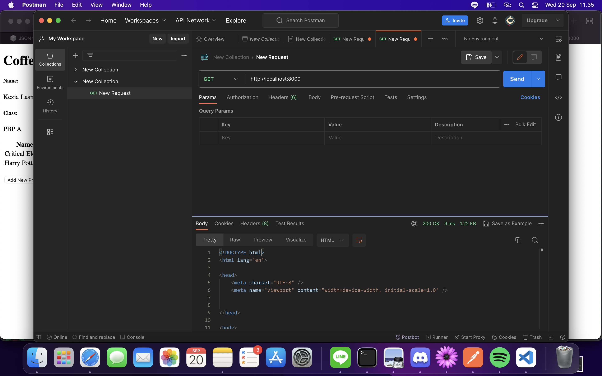
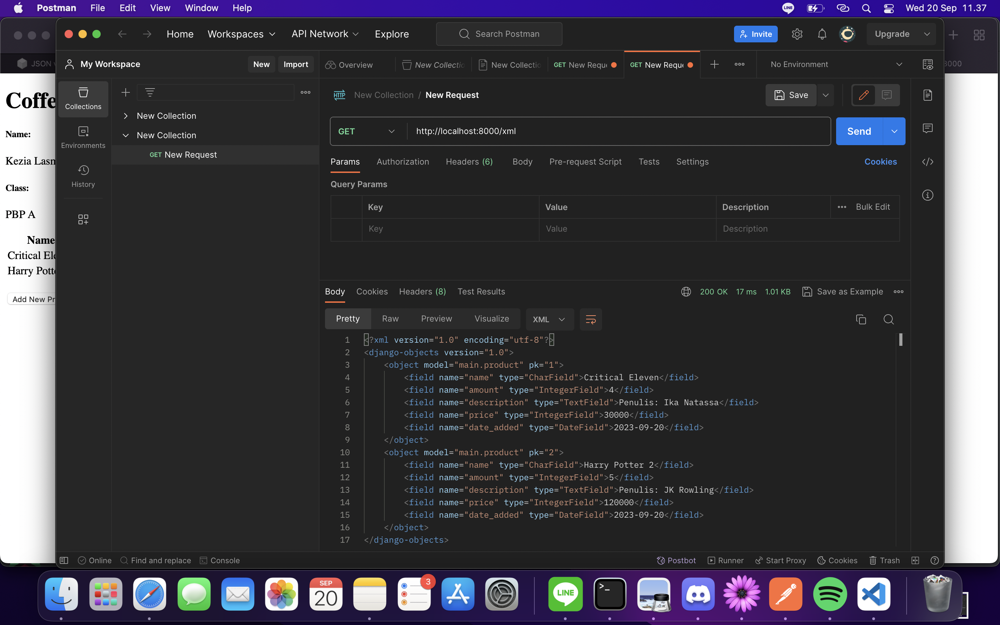
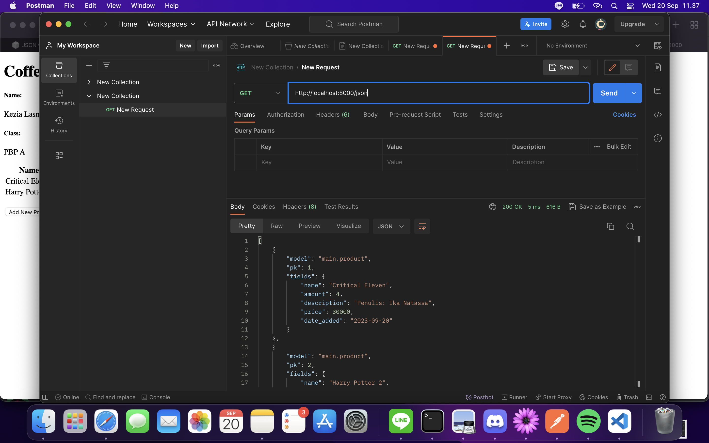
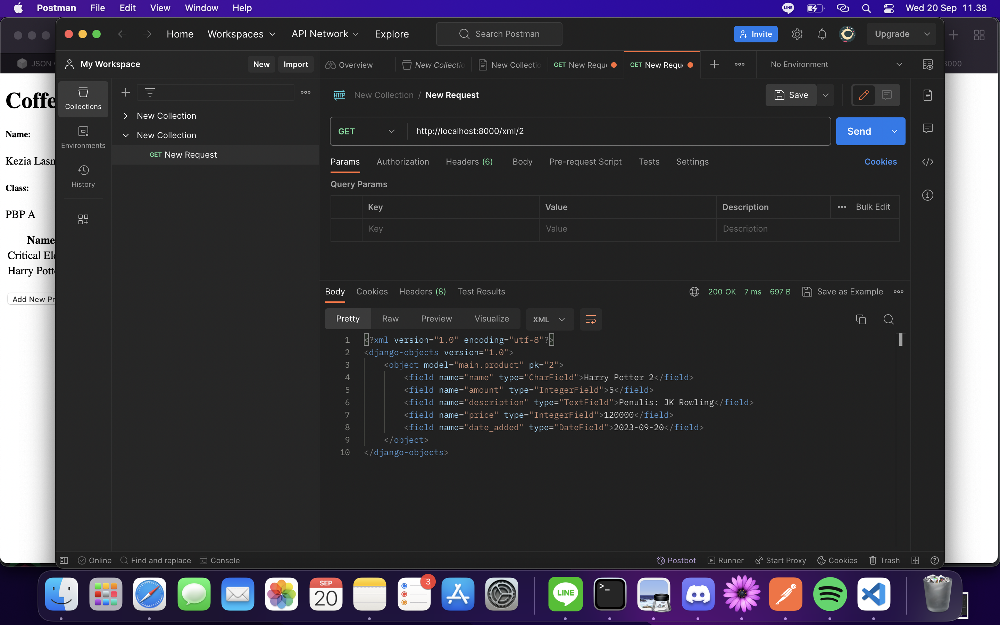
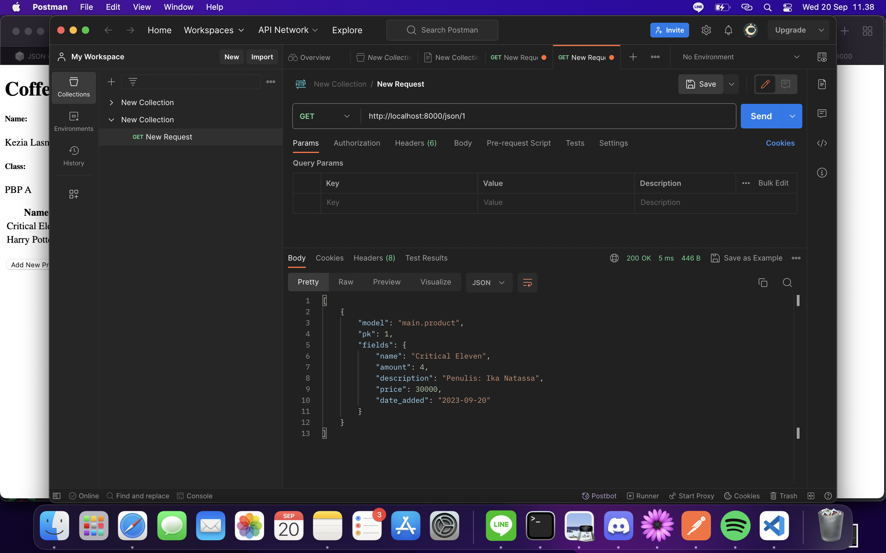
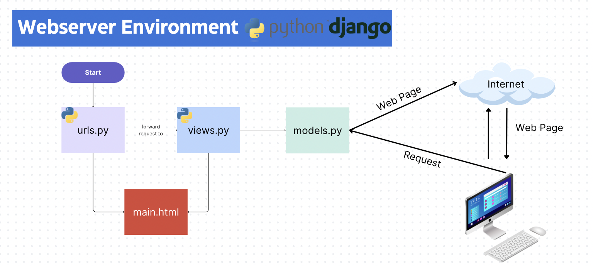

Nama    : Kezia Lasma Angelica

NPM     : 2206082234

Kelas   : PBP A

Link Adaptable  : https://mini-perpus.adaptable.app
Link PaaS       : http://kezia-lasma-tugas.pbp.cs.ui.ac.id/

<details>
<summary>TUGAS 6</summary>

1.  Jelaskan perbedaan antara asynchronous programming dengan synchronous programming.  
    Synchronus programming memiliki cara kerja menunggu syntax per baris selesai dikerjakan terlebih dulu, kemudian baru melanjutkan ke syntax dibawahnya sehingga tidak bisa mengeksekusi beberapa kode secara bersamaan. Sementara asynchronus programming dapat mengeksekusi beberapa tugas secara bersamaan dengan menginisiasi 'async' pada pendefinisian function agar function tersebut mengembalikan sebuah promise, kemudian menggunakan syntax 'await' untuk untuk menjeda eksekusi program dan menunggu promise terselesaikan terlebih dulu untuk melanjutkan program.  

2.  Dalam penerapan JavaScript dan AJAX, terdapat penerapan paradigma event-driven programming. Jelaskan maksud dari paradigma tersebut dan sebutkan salah satu contoh penerapannya pada tugas ini.  
    Dalam pemrograman, event-driven programming adalah suatu keadaan dimana program memberikan timbal balik output dari suatu kejadian input dari user atau yang biasa disebut dengan event handling. Dalam AJAX dan JavaScript yang digunakan kali ini, program akan memberikan respon ketika user melakukan aksi, seperti klik button, submit, dan lain sebagainya, tanpa harus menunggu eksekusi kode sebelumnya selesai dilakukan. Pada tugas kali ini, salah satu event-driven yang digunakan adalah 'onclick', dimana ketika fungsi addProduct() dijalankan, program akan mengirim data ke server menggunakan AJAX, kemudian tampilan produk akan terbarui secara dinamis tanpa reload halaman secara manual.  

3.  Jelaskan penerapan asynchronous programming pada AJAX.  
    AJAX merupakan teknologi yang memadukan Javascript dan HTML DOM untuk menampilkan data serta peramban web untuk meminta data dari server. Teknologi ini memungkinkan halaman web untuk memperbarui data secara asinkronus dengan mengirimkan data ke peladen dibalik layar untuk memperbarui sebagian elemen data pada halaman tanpa harus me-reload halaman secara keseluruhan sehingga bersifat lebih interaktif dengan pengguna karena program merespon langsung permintaan user tanpa harus menunggu bagian kode yang lain selesai dikerjakan. Cara kerja asynchronus programming pada AJAX adalah:  
    a.  AJAX akan membuat surat permintaan data ke server berdasarkan apa yang diminta oleh user  
    b.  Setelah surat permintaan tersebut sudah lengkap, maka AJAX akan langsung mengirimkannya ke server tanpa harus menunggu balasan server.  
    c.  Sementara AJAX menunggu balasan server, AJAX akan tetap berinteraksi dengan user, sehingga program tidak terhenti hanya untuk menunggu respon atas permintaan sebelumnya  
    d.  Setelah server sudah memberikan respon atas permintaan user, AJAX akan memeriksa balasan tersebut. Jika tidak ada permasalahan pada balasan tersebut, maka AJAX akan menampilkan balasan tersebut kepada user melalui tampilan program  
    
4.  Pada PBP kali ini, penerapan AJAX dilakukan dengan menggunakan Fetch API daripada library jQuery. Bandingkanlah kedua teknologi tersebut dan tuliskan pendapat kamu teknologi manakah yang lebih baik untuk digunakan.  
    Jika menggunakan Fetch API kita tidak perlu menggunakan unduhan atau instalasi tambahan seperti pustaka eksternal dan Fetch API menggunakan promise untuk menangani respons dari permintaan yang memudahkan pengelolaan alur asinkronus dan memisahkan permintaan dan respons sehingga memungkinkan manipulasi data secara independen. Jika menggunakan library jQuery, maka akan lebih leluasa karena library jQuery kompatibel secara lintas browser dan syntax nya lebih ringkas untuk melakukan permintaan dan penanganan respon dengan berbagai utilitas yang disediakan.  
    Jika perlu memilih teknologi mana yang lebih baik digunakan, maka akan lebih baik menggunakan Fetch API karena memiliki kontrol yang baik dan terintegrasi dengan promise yang cocok untuk proyek dengan teknologi modern.  

5.  Jelaskan bagaimana cara kamu mengimplementasikan checklist di atas secara step-by-step (bukan hanya sekadar mengikuti tutorial).  
    a.  Membuat fungsi get_product_json(request) untuk mengambil data produk dan di serialize ke format json  
    b.  Membuat fungsi add_product_ajax(request) untuk melakukan add product dengan AJAX, dengan function diisi oleh variabel yang sesuai dengan models yang kita pakai  
    c.  Melakukan routing kedua fungsi tersebut di urls.py  
    d.  Membuat struktur card pada `for products in products` sebelumnya dan mengganti dengan struktur card yang baru dengan menandakan ID pada setiap objek card yang dibuat, contohnya `<div id="product_cards"></div>`  
    e.  Membuat block `<Script>` berisi function async getProducts() dengan return fetch dari function get_product_json()  
    f.  Menambahkan fungsi async refreshProducts() yang berfungsi untuk merefresh data produk secara asynchronus. Pada function inilah kita menginisiasi card dan atribut-atributnya yang sebelumnya kita inisiasikan di `for products in products`. Agar ter synchronize dengan data tiap produk, kita dapat menggunakan for loop `products.forEach(item)` yang menggunakan variabel htmlString untuk mengumpulkan isi dari for loop tersebut, kemudian melakukan getElementById  
    f.  Menambahkan modal form dalam bentuk Bootstrap serta buttonnya untuk menampilkan modal
    g.  Membuat function addProduct() pada block Script untuk membuat sebuah FormData baru yang datanya diambil dari form pada modal. Objek FormData dapat digunakan untuk mengirimkan data form tersebut ke server melalui syntax `new FormData(document.querySelector('#form'))` dan mengosongkan isi form setelah submit dengan `document.getElementById("form").reset()` serta menambahkan `document.getElementById("button_add").onclick = addProduct` untuk event handling ketika terjadi onclick pada button add product

</details>

<details>
<summary>TUGAS 5</summary>

1.  Jelaskan manfaat dari setiap element selector dan kapan waktu yang tepat untuk menggunakannya.  
    a. Universal Selector (*) adalah sebuah jenis elemen selector dalam CSS yang memilih atau mempengaruhi semua elemen di dalam dokumen HTML sehingga selector ini digunakan saat kita ingin menerapkan style elemen tersebut dalam seluruh dokumen  
    b. Type Selector adalah elemen selector yang dapat digunakan saat kita ingin menerapkan style pada semua instance dari elemen tertentu, contohnya mengubah warna teks atau size text dengan menggunakan 'p', 'h1', 'div'.  
    c. Class Selector (.classname) digunakan ketika ingin menerapkan style pada semua elemen yang memiliki kelas tertentu seperti 'container', 'box', 'button'.  
    d. ID Selector dapat digunakan ketika kita ingn menerapkan style pada elemen yang memiliki ID unik seperti '#header' dalam satu halaman.  
    e. Pseudo class dapat digunakan ketika ingin menerapkan style pada elemen dengan kondisi tertentu seperti saat mouse diarahkan, saat button diklik. Contoh dari pseudo class adalah ':hover', ':active'  

2.  Beberapa HTML5 Tag yang saya ketahui adalah:  
    a. 'header' yang digunakan untuk menandakan bagian atas dari halaman web atau dari sebuah elemen atau sekelompok elemen.  
    b. nav sebagai penanda daftar navigasi untuk tautan navigasi ke bagian-bagian lain dari halaman atau ke halaman-halaman lain  
    c. section yang digunakan untuk menyusun konten dalam satu bagian terkait dalam dokumen seperti artikel atau bagian khusus dari halaman.  
    d. div yang digunakan sebagai kontainer untuk mengelompokkan dan mengorganisir beberapa elemen dalam dokumen menjadi suatu kesatuan  
    e. footer yang digunakan untuk mendefinisikan bagian bawah dari halaman atau akhir dari elemen atau sekelompok elemen.  

3.  Jelaskan perbedaan antara margin dan padding.  
    Margin memiliki konsep yang berada di luar batas elemen antara elemen dan elemen lain di sekitarnya yang menciptakan jarak antara elemen dengan elemen tetangganya atau dengan tepi area konten. Sifatnya sendiri tidak terpengaruh oleh background atau border dan bersifat transparan secara default sehingga jika kita menggunakan elemen seperti warna background, maka margin tidak akan memiliki pengaruh pada elemen tersebut. 
    Sementara itu, padding memiliki konsep yang mengatur ruang bagian dalam elemen, dimana padding mengontrol ruang diesekitar konten elemennya seperti contohnya mengatur jarak sisi-sisi box pada text yang ada didalamnya. Selain itu, padding juga mempengaruhi background karena padding dapat menampilkan warna background.  

4.  Bootstrap dan Tailwind CSS adalah dua framework CSS yang membantu dalam pembuatan desain situs web. Keduanya memiliki berbeda dalam membangun style dalam komponen situs web dimana Bootstrap memberikan komponen-komponen bawaan yang lebih terstruktur sehingga pada saat tertentu sulit untuk mengubah komponen sesuai dengan kebutuhan khusus tanpa menimpa banyak gaya bawaan Bootstrap. Sementara itu, Tailwind CSS adalah framework utility-first yang memberikan kelas-kelas utilitas yang kuat dan memberikan fleksibilitas besar dalam tata letak dan desain. Bootstrap lebih cocok jika ingin membangun situs dengan cepat karena menggunakan komponen bawaan yang telah dirancang dengan baik. Tetapi jika kita ingin mmebuat situs dengan tingkat kustomisasi tinggi atau ingin mendesain dari nol, akan lebih nyaman menggunakan Tailwind CSS yang memberikan kebebasan lebih besar melalu kelas-kelas yang disediakan.  

5.  Jelaskan bagaimana cara kamu mengimplementasikan checklist di atas secara step-by-step (bukan hanya sekadar mengikuti tutorial).  
    a. Kustomisasi halaman login, register, dan tambah inventori semenarik mungkin.  
    Pertama, saya merancang desain yang saya inginkan di aplikasi Figma. Kemudian, saya menggunakan markup tags css style untuk menyusun desain-desain tersebut. Dalam markup tags tersebut, saya membuat komponen-komponen apa saja yang ingin saya berikan style, dimana ada beberapa komponen sepert body, container, box, form, button, juga dengan beberapa kondisi atau gayanya seperti saat hover atau model text heading(h) atau paragraph(p). Kemudian dalam komponen-komponen tersebut saya mengatur stylenya denga inisiasi background color, margin, padding, text align, border serta radiusnya, juga font dan font sizenya.  
    b. Kustomisasi halaman daftar inventori menjadi lebih berwarna maupun menggunakan apporach lain seperti menggunakan Card.  
    Pada daftar inventori, saya menambah kustomisasi dengan menggunakan card dan radio choice sebagai additional choice untuk produk saya. Untuk card, saya menerapkan desainnnya dengan menandakan bagian dari card menggunakan 'div class' serta mengatur stylenya seperti width, height, display, margin. Didalam 'div', saya menginisiasi bagian card seperti header, body, dan title.  
    Kemudian untuk mengkustomisasi radio choice, saya menandakan terlebih dulu apa saja yang ingin customize, dalam hal ini saya menambahkan pilihan 'hot, cold' untuk 'type' dan 'less sweet, normal sweet' untuk 'sweetness. Kemudian saya mendaftarkan additional tersebut berupa variabel pada models.py serta tipe datanya dan menambahkannya juga pada fields di models.py dan setelah itu melakukan migration sebagai langkah wajib ketika melakukan perubahan pada model produk. Agar tampilan dari additionals tersebut muncul pada card products, tidak lupa saya menambahkan bagian tersebut pada card text dalam card div.
</details>

<details>
<summary>TUGAS 4</summary>

1.  Apa itu Django UserCreationForm, dan jelaskan apa kelebihan dan kekurangannya?  
    Django UserCreationForm adalah impor bawaan `django.contrib.auth.forms` yang menyedeiakan template pengisian form seperti nama, password, dan konfirmasi password sehingga adanya UserCreationForm dapat membantu developer untuk tidak perlu panjang-panjang membuat code untuk standar pengisian form dan bahkan pengisian password sudah memiliki section konfirmasi. Sayangnya, UserCreationForm belum menyediakan template untuk data pendaftaran lebih detail seperti tanggal lahir dan jenis kelamin/ Selain itu, verifikasi identitas dan oersetujuan persyaratan juga belum tersedia di bawaan ini. 

2.  Apa perbedaan antara autentikasi dan otorisasi dalam konteks Django, dan mengapa keduanya penting?  
    Authentication adalah proses memastikan identitas pengguna ketika masuk ke sebuah sistem dengan tujuan untuk mengenali atau memvalidasi user yang masuk. Tahapan awal dari authentication sendiri adalah dengan user menciptakan "lingkungan" nya sendiri pada sebuah sistem (register), kemudian ketika user akan masuk kembali ke sistem, ia akan melewati proses autentikasi seperti login dengan username dan password dan akan diautentikasi oleh sistem apakah username dan password yang dimasukkan sudah benar. Autentikasi diperlukan untuk menjaga keamanan data user agar tidak bisa diakses secara sembarang  
    Sementara itu, authorization adalah proses memastikan bahwa user memiliki izin untuk masuk kedalam sebuah sistem. Hal ini dilakukan untuk memastikan bahwa tidak sembarang orang dapat mengakses sistem tersebut. Tahapan dari authorization biasanya dapat dilakukan setelah proses authentication selesai, dimana ketika user sudah tervalidasi masuk ke sistem, sistem akan menentukan akses apa saja yang dibuka untuk user tersebut sesuai dengan kriteria ketika user membuat "lingkungan" nya pada sistem. Authorization adalah salah satu komponen penting untuk mengontrol akses yang berbeda-beda dari tiap user.  

3.  Apa itu cookies dalam konteks aplikasi web, dan bagaimana Django menggunakan cookies untuk mengelola data sesi pengguna?  
    Cookies adalah data kecil yang disimpan pada client side untuk menandakan aksi yang dilakukan oleh pengguna tergantung oleh jenis cookienya. Cookie biasanya digunakan untuk mengelola sesi pengguna dengan menggunakan Session ID yang di-generate secara random. Kemudian, Django akan menyimpan data dari sesi tersebut dan hanya akan menggunakan Session ID yang disimpan dalam cookie di sisi klien. Setelah data sesi tersimpan, server akan mengirimkan Session ID ini kembali ke client dalam bentuk cookie. Cookie ini kemudian akan dikirimkan kembali oleh client ke server setiap kali permintaan HTTP dibuat ke aplikasi. Session ID inilah yang akan digunakan untuk mengidentifikasi pengguna dan data-datanya. Setelah pengguna melakukan logout, maka data dari sesi tersebut yang berkaitan dengan Session ID yang logout akan terhapus.  

4.   Apakah penggunaan cookies aman secara default dalam pengembangan web, atau apakah ada risiko potensial yang harus diwaspadai?  
    Ya, ada yang harus diwaspadai. Cookie rentan terhadap pencurian informasi sensitif jika tidak dielakukan dengan benar karena dapat menjadi target serangan Cross-Site Scripting (XSS) yang dimana penyerang dapat memasukkan script berbahaya ke halaman web dan mencuri cookies atau juga menjadi peluang serangan Man-in-the-Middle (MitM) alias disadap melalui lalu lintas jaringan jika koneksi tidak dienkripsi dengan HTTPS. Maka dari itu, penting untuk mengonfigurasi cookies dengan benar, dengan mengatur atribut Secure dan HttpOnly untuk melindungi informasi sensitif.

5. Checklist Tugas  
    a. Mengimplementasikan fungsi registrasi, login, dan logout untuk memungkinkan pengguna untuk mengakses aplikasi sebelumnya dengan lancar: Membuat 3 fungsi pada `views.py` yaitu  
    - Register: fungsi untuk membuat akun user menggunakan metode "POST" dimana client mengirim data registrasi ke server dengan menambahkan impor bawaan Django yaitu `UserCreationForm()` untuk mempermudah pembuatan kode untuk form bagi developer. Setelah menginisiasi fungsi diatas, kita perlu membuat berkas HTML nya pada templates. berikut adalah cara menginisiasi fungsi:   
    ```python
    from django.shortcuts import redirect
    from django.contrib.auth.forms import UserCreationForm
    from django.contrib import messages  

    ...
    def register(request):
    form = UserCreationForm()

    if request.method == "POST":
        form = UserCreationForm(request.POST)
        if form.is_valid():
            form.save()
            messages.success(request, 'Your account has been successfully created!')
            return redirect('main:login')
    context = {'form':form}
    return render(request, 'register.html', context)
    ```
    - Login: fungsi yang mengirim request autentikasi username dan password user dalamm bentuk "POST" dan mengautentikasinya dengan impor bawaan `authenticate(request, username=username, password=password`.Setelah menginisiasi fungsi diatas, kita perlu membuat berkas HTML nya pada templates. berikut adalah cara menginisiasi fungsi:  
    ```python
    from django.contrib.auth import authenticate, login

    ...
    def login_user(request):
    if request.method == 'POST':
        username = request.POST.get('username')
        password = request.POST.get('password')
        user = authenticate(request, username=username, password=password)
        if user is not None:
            login(request, user)
            return redirect('main:show_main')
        else:
            messages.info(request, 'Sorry, incorrect username or password. Please try again.')
    context = {}
    return render(request, 'login.html', context)
    ```  
    - Logout: fungsi yang mengirim request logout ke server, kemudian akan mengarahkan sistem ke page login
    Fungsi-fungsi yang sudah dibuat ini akan ditambahkan pathnya ke `urlpatterns` pada `urls.py`. Kemudian kita juga perlu merestriksi halaman main dengan
    ```python
    from django.contrib.auth.decorators import login_required
    ```  
    kemudian menambahkan `@login_required` diatas fungsi show_main
    ```python
    ...
    @login_required(login_url='/login')
    def show_main(request):
    ...
    ``` 

    b. Membuat dua akun pengguna dengan masing-masing tiga dummy data menggunakan model yang telah dibuat pada aplikasi sebelumnya untuk setiap akun di lokal.  
    - Pertama, kita akan melakukan register 2 akun di lokal. Setelah itu, login pada kedua akun tersebut dan membuat `3 dummy data berbeda` berdasarkan models yang sudah dibuat, dimana pada models saya, saya memggunakan name, amount, description, dan price.  

    c. Menghubungkan model Item dengan User  
    Menghubungkan model Item dengan User dilakukan agar Item yang muncul tersinkron dengan user yang sedang login kedalam sistem. Tahapannya adalah:  
    - Pada models.py, kita akan mengimpor model `User` dan menghubungkan satu produk dengan satu user menggunakan `ForeignKey`  
    ```python
    ...
    from django.contrib.auth.models import User
    ...
    class Product(models.Model):
    user = models.ForeignKey(User, on_delete=models.CASCADE)
    ...  
    ```  
    - Kemudian, kita akan menambahkan parameter `commit=False` pada `form.save()` di fungsi `creat_product` pada `views.py/main` yang bertujuan agar objek yang baru dibuat tidak langsung disimpan ke database, tetapi akan dimodifikasi terlebih dulu untuk memasukkan field `user` dengan objek `User` dari return value `request.user` untuk menandakan bahwa objek yang dibuat adalah milik user yang sedang login.Berikut adalah contoh kodenya:
    ```python
    def create_product(request):
    form = ProductForm(request.POST or None)

    if form.is_valid() and request.method == "POST":
        product = form.save(commit=False)
        product.user = request.user
        product.save()
        return HttpResponseRedirect(reverse('main:show_main'))
    ...
    ```  
    - Setelah itu, context `name` pada fungsi `show_main` akan diubah menjadi `'name': request.user.username,` agar objek produk yang ditampilkan adalah objek yang terasosiasi dengan user yang login
    - Karena kita menambahkan model baru yaitu `User`, maka kita perlu melakukan `python manage.py makemigrations`. Sebelum melakukan migrate, akan muncul error yang perlu diatasi dengan memberikan reply `1` di terminal pada error tersebut untuk menetapkan default value. Baru setelah itu kita bisa melakukan migration dengan `python manage.py migrate`

    d. Menampilkan detail informasi pengguna yang sedang logged in seperti username dan menerapkan cookies seperti last login pada halaman utama aplikasi.  
    Untuk menampilkan informasi pengguna yang sedang logged in seperti username, maka kita perlu mengubah context `name` pada fungsi `show_main` di `views.py/main`  menjadi `'name': request.user.username,` agar objek produk yang ditampilkan adalah objek yang terasosiasi dengan user yang login. Untuk menerapkan cookies seperti last login pada main page, maka tahapan yang perlu dilakukan:  
    - Logout akun yang sedang login pada aplikasi Django, kemudian kita akan mengimpor beberapa fungsi  
    ```python
    import datetime
    from django.http import HttpResponseRedirect
    from django.urls import reverse
    ```
    - Lalu pada fungsi `login_user`, kita akan menambahkan fungsi `last_login` pada blok `if User is not None`  
    ```python
    if user is not None:
    login(request, user)
    response = HttpResponseRedirect(reverse("main:show_main")) # Untuk membuat response
    response.set_cookie('last_login', str(datetime.datetime.now())) # Membuat cookie last login dan ditambahkan ke response
    ```
    - Kemudian kita juga akan menambahkan variabel `'last_login': request.COOKIES['last_login'],` pada `context` di fungsi `show_main`
    - Lalu pada fungsi `logout_user`, kita akan menambahkan `response.delete_cookie('last_login')` agar cookie `last_login` dihapus saat pengguna melalukan logout

</details>


<details>
<summary>TUGAS 3</summary>

1. Apa perbedaan antara form POST dan form GET dalam Django?  
    Method GET dan Post merupakan method yang digunakan untuk mengirim request HTTP ke server. Perbedaanya yaitu terletak pada tampilan URL, dimana GET akan menampilkan request HTTP pada URL, sementara POST tidak menampilkan request HTTP sehingga lebih aman untuk data yang membutuhkan privasi.  
    Contoh:  
    GET     : google.com/search?q=difference+between+post+and+get  
    POST    : https://scele.cs.ui.ac.id/user/profile.php?id=5465 (tidak menampilkan username dan password)  

2. Apa perbedaan utama antara XML, JSON, dan HTML dalam konteks pengiriman data?  
    a. XML     : Menggunakan markup tags sebagai basis sintaksnya. Sifat datanya terstruktur dan memiliki validasi yang kuat sehingga biasanya digunakan untuk konfigurasi aplikasi.
    b. JSON    : Menggunakan format pasangan key dan value. JSON mempunyai struktur yang lebih sederhana dibandingkan XML, namun ukuran datanya jauh lebih efisien sehingga biasanya digunakan untuk pengembangan web yang membutuhkan pertukaran data antara server dan client.
    c. HTML     : HTML juga menggunakan markup tags sebagai basis sintaksnya, namun tujuannya adalah untuk merender tampilan sehingga biasanya digunakan untuk membuat tampilah halaman web  

3. Mengapa JSON sering digunakan dalam pertukaran data antara aplikasi web modern?  
    JSON sering digunakan dalam pertukaran data aplikasi web modern karena formatnya lebih sederhana dan ringkas (menjadi lebih mudah dibaca oleh mesin) sehingga komunikasi pertukaran data dapat berlangsung dengan cepat  

4. Jelaskan bagaimana cara kamu mengimplementasikan checklist di atas secara step-by-step (bukan hanya sekadar mengikuti tutorial).  
    A. Membuat input form untuk menambahkan objek model pada app sebelumnya  
        - Membuat berkas forms.py pada direktori main untuk menginisiasi fields data yang akan dibutuhkan untuk produk. Pada produk saya, saya menggunakan fields name, amount, description, price serta   
        - Menambahkan import HttpResponseRedirect, ProductForm, dan reverse pada views.py
        - Membuat fungsi createProduct dengan parameter request untuk menginisiasi formulir yang menambahkan data produk yang baru diisi pada file tersebut
        - Menambahkan variabel products = Product.objects.all() pada views.py agar seluruh objek Product tersimpan di database
        - Membuka file urls.py di direktori utama untuk melakukan import fungsi create_product serta me-routing path create_product ke urlpatterns
        - Membuat file create_product.html pada templates yang mengextend base.html. File ini akan menginisiasi tampilan untuk "Add Products"  
    B. Menambahkan 5 fungsi views untuk melihat objek yang sudah ditambahkan dalam format HTML, XML, JSON, XML by ID, dan JSON by ID.  
        - Untuk melihat dalam format HTML, buat fungsi baru pada views.py, yaitu create_item dengan request untuk merender request product
        - Kemudian membuat file create_item.html pada templates untuk membuat tampilan page "Add Items"
        - Untuk format HTML dan JSON, impor HttpResponse dan serializers pada views.py, yang dimana serializers berfungsi untuk translater objek ke model XML dan JSON  
        - Membuat fungsi show_xml dan show_JSON yang menerima parameter request dengan melakukan serialize response data ke XML atau JSON
        - Jika ingin melihat objek berdasarkan ID, maka tambahkan fungsi show_xml_by_id dan show_json_by_id dengan menambahkan parameter id kedalam fungsi  
        - Tambahkan fungsi-fungsi yang telah dibuat tadi sebagai import kedalam folder urls.py dan menambahkan path URL fungsi-fungsi tadi kedalam urlpatterns  
    C. Membuat routing URL untuk masing-masing views yang telah ditambahkan pada poin 2.  
    -  Mengimpor fungsi-fungsi yang telah dibuat kedalam urls.py dan menambahkan path url kedalam urlpatterns
    ```python
    from django.urls import path
    from main.views import show_main, create_item, show_xml, show_json, show_xml_by_id, show_json_by_id 

    app_name = 'main'

    urlpatterns = [
        path('', show_main, name='show_main'),
        path('create-item', create_item, name='create_item'),
        path('xml/', show_xml, name='show_xml'), 
        path('json/', show_json, name='show_json'),
        path('xml/<int:id>/', show_xml_by_id, name='show_xml_by_id'),
        path('json/<int:id>/', show_json_by_id, name='show_json_by_id'),  
    ]
    ```  
5. Screenshot Postman  
    A. HTML  
    
    B. XML  
    
    C. JSON  
    
    D. XML by ID
    
    E. JSON by ID
    

Referensi:
- https://aws.amazon.com/id/compare/the-difference-between-json-xml/

</details>

<details>
<summary>TUGAS 2</summary>
A.  Checklist

1. Membuat sebuah proyek Django baru:   
    a. Membuat direktori lokal yang kemudian akan menjadi direktori utama  
    b. Menyalakan virtual environment setiap akan membuat proyek baru agar dependencies untuk tiap proyek terisolasi  
    c. Menyiapkan dependencies dalam berkas requirements.txt dan menginstallnya  
    d. Membuat proyek baru dengan command `django-admin startproject`

2. Membuat aplikasi dengan nama main pada proyek tersebut: Menjalankan command `python manage.py startapp main` pada direktori utama dan mendaftarkannya pad settings.py

3. Melakukan routing pada proyek agar dapat menjalankan aplikasi main: Membuat berkas urls.py pada direktori main dan mengisi file tersebut dengan:  
    a. Mengimpor path dari django.urls untuk mendefinisikan pola URL.  
    b. Menggunakan fungsi `show_main` dari modul main.views sebagai tampilan yang akan ditampilkan ketika URL terkait diakses.  
    c. Memberikan app_name untuk memberikan nama unik pada pola URL dalam aplikasi.

4.  Membuat model pada aplikasi main dengan nama Item dan memiliki atribut wajib: Mengisi berkas models.py dengan   
    a. models.Model yaitu kelas dasar yang digunakan untuk mendefinisikan model dalam Django.  
    b. Product yaitu nama model yang ingin didefinisikan.  
    c. Menambahkan atribut seperti nama, harga, dan deskripsi dan mengelompokkan tiap atribut kedalam tipe data yang sesuai seperti CharField, DateField, IntegerField, dan TextField.

5.  Membuat sebuah fungsi pada views.py untuk dikembalikan ke dalam sebuah template HTML yang menampilkan nama aplikasi serta nama dan kelas kamu:  
    a. Mengisi berkas views.py dengan `from django.shortcuts import render`  
    b. Menambahkan fungsi `def show_main(request)` yang mengatur permintaan HTTP dan mengembalikan tampilan yang sesuai.  
    c. Menambahkan "context" yang berisi data yang akan dikirimkan ke tampilan (berupa data nama dan kelas)  
    d. Menambahkan "render" tampilan yang berisi  
        - `request` yang berisi objek permintaan HTTP yang dikirim oleh pengguna.  
        - `main.html` yang berisi berkas template yang akan digunakan untuk me-render tampilan.  
        - `context` yang merupakan dictionary berisi data yang akan diteruskan ke tampilan untuk digunakan dalam penampilan dinamis.

6.  Membuat sebuah routing pada urls.py aplikasi main untuk memetakan fungsi yang telah dibuat pada views.py: Menambahkan isi urls.py pada direktori proyek dengan mengimpor fungsi include dari django.urls dan rute URL dari aplikasi lain untuk diarahkan ke tampilan main melalui variabel urlpatterns

7.  Melakukan deployment ke Adaptable terhadap aplikasi yang sudah dibuat sehingga nantinya dapat diakses oleh teman-temanmu melalui Internet:  
    a. Membuat akun Adaptable dan menyambungkannya dengan akun GitHub  
    b. Membuat "New App" dan menyambungkannya dengan repositori GitHub yang sudah ada dengan memilih "All Repositories" pada proses instalasi  
    c. Memilih repositori yang akan di-deploy ke Adaptable  
    d. Memilih Python App Template sebagai template deployment dan memilih PostgreSQL sebagai tipe basis data yang akan digunakan.  
    e. Menyesuaikan versi Python dengan spesifikasi aplikasi dengan mengecek terlebih dulu versi python melalui penyalaan virtual environment dan menjalankan python --version.  
    f. Menambahkan `python manage.py migrate && gunicorn mini_perpus.wsgi` pada bagian "Start Command"  
    g. Memasukkan nama aplikasi yang akan menjadi domain untuk situs web aplikasi dan mencentang HTTP Listener on PORT  
    h. Klik "Deploy App", kemudian proses deployment akan dimulai


B.  Buatlah bagan yang berisi request client ke web aplikasi berbasis Django beserta responnya dan jelaskan pada bagan tersebut kaitan antara urls.py, views.py, models.py, dan berkas html. 

  
    Pertama, client akan membuat request ke URL aplikasi Django melalui internet. Kemudian, urls.py akan memetakan request tersebut melalui route yang menghubungkan URL yang diminta dengan fungsi atau kelas tampilan yang akan menanganinya. Lalu, views.py akan menerima permintaan dan memprosesnya sesuai dengan logika aplikasi. Misal dalam halaman profil, views akan memeriksa data pengguna yang diminta dan mempersiapkan data tersebut untuk ditampilkan. Selanjutnya views.py akan berinteraksi dengan models.py untuk mengakses atau memperbarui data di database. Setelah memproses data, views akan menggunakan template HTML yang berisi struktur dan elemen-elemen HTML untuk menyusun halaman web dengan mengisi data yang diperlukan. Setelah halaman web selesai dibuat, aplikasi akan mengirimkannya sebagai respons (response) kembali kepada client yang mengakses URL tersebut melalui internet dengan tampilan yang sesuai dengan request.  

C. Jelaskan mengapa kita menggunakan virtual environment? Apakah kita tetap dapat membuat aplikasi web berbasis Django tanpa menggunakan virtual environment?  
    Virtual environment dibutuhkan untuk mengisolasi dependencies dari suatu proyek, yang dimana dependencies tersebut tercatat pada requirements.txt. Hal ini akan memudahkan developer dalam mengelola berbagai proyek karena tiap proyek akan memiliki environment dan dependenciesnya masing-masing yang sudah terpisah. Sebenarnya, aplikasi web berbasis Django tetap dapat dibuat tanpa menggunakan virtual environment jika hanya dilakukan pada server local. Namun, hal ini akan sulit dilakukan jika kita akan melakukan deploy project menggunakan online hoster karena online hoster perlu menyesuaikan dependencies yang diperlukan proyek dengan mesin hosting.

D. Jelaskan apakah itu MVC, MVT, MVVM dan perbedaan dari ketiganya  
    a. MVC (Model-View-Controller):  
        - Model: Komponen yang mengatur dan mengelola logika aplikasi, data, validasi, dan interaksi.
        - View (Tampilan): Komponen yang mengontrol bagaimana data yang dikelola oleh model akan ditampilkan dengan menyiapkan komponenen-komponen yang akan terlibat seperti text boxes, dropdowns, dan lainnya.
        - Controller (Kontroler): Sebagai penengah dari Model dan View yang bertugas untuk memproses logika dan permintaan yang masuk dan berinteraksi dengan View untuk me-render output.
    b. MVT (Model-View-Template):  
        - Model: Sama seperti dalam Model dalam MVC yang bertugas mengelola data dan aplikasi.
        View (Tampilan): Berperan sebagai pengatur tampilan dengan mengambil data dari model untuk ditampilkan kepada pengguna
        - Template: Mengatur tampilan atau antarmuka pengguna dengan memisahkan kode HTML dari logika aplikasi untuk merancang tampilan yang diisi dengan data dari Model melalui View.
    c. MVVM (Model-View-ViewModel):
    - Model (Model): Sama seperti Model dalam MVC dan MVT yang bertugas mengelola data dan logika aplikasi.
    - View (Tampilan): Bertanggung jawab untuk menyiapkan elemen yang akan ditampilkan dan menerima input dari user.
    - ViewModel (Model Tampilan): Menjadi jembatan antara Model dan View yang mengontrol interaksi dari View  
    d. Perbedaan:  
    Pada MVC, terdapat controller yang mengendalikan Model dan View yang ditulis dengan kode spesifik untuk mengontrol. Sementara pada MVT, terdapat View yang menerima request dan mengembalikan respon dari HTTP dan Controller pada MVT sudah diatur oleh frameworknya sendiri.
    MVT adalah sebuah adaptasi dari MVC yang lebih khusus untuk kerangka kerja Django. Pada MVVM, logika yang digunakan yaitu data-binding, yang memudahkan dalam membuat perubahan pada aplikasi dibanding dengan MVC yang kodenya berlapis-lapis.

</details>